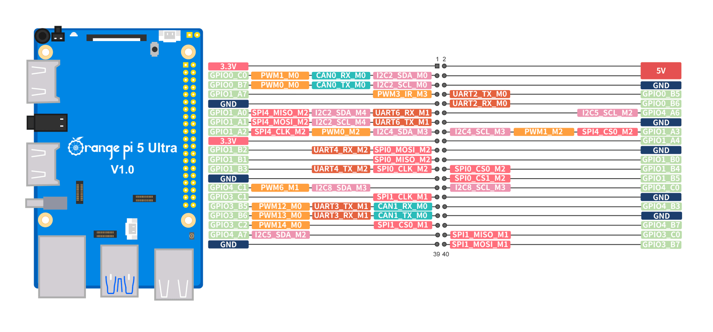

# Pi Simple Fan Control

A lightweight PWM fan controller that uses the Linux sysfs PWM interface. Tested on an **Orange Pi 5 Ultra** but intended to work on other boards (including Raspberry Pi) that expose a compatible `/sys/class/pwm/pwmchip*/pwm*` device.



## Features
- Controls a PWM fan based on CPU temperature with a linear ramp
- Uses sysfs PWM (no `gpio` dependency), works with inverted PWM wiring
- Configurable thresholds, poll interval, and startup “kick” to overcome stall
- Install via script or manual copy; systemd service included

## Requirements
- Bash, curl, and systemd
- Root access (writes to `/sys/class/pwm`, `/etc`, `/usr/local/bin`)
- A board that exposes a PWM channel (defaults to `pwmchip0/pwm0`)
- For Raspberry Pi, make sure a PWM channel is enabled via device-tree overlay so it appears under `/sys/class/pwm`
- On Orange Pi boards, disable the vendor fan service to avoid conflicts:
  ```bash
  sudo systemctl disable pwm-fan.service
  sudo systemctl mask pwm-fan.service
  ```

## Enabling PWM
You must enable a PWM channel so it shows up under `/sys/class/pwm`.

Example (Debian, Orange Pi 5 Ultra):
- Use `orangepi-config`: go to **System** → **Hardware** and enable the PWM (pwm3-m3) entry that maps to header pin 7. Reboot.
- Or edit `/boot/orangepiEnv.txt` and add:
  ```bash
  overlays=pwm3-m3
  ```
  then reboot. This exposes `/sys/class/pwm/pwmchip0/pwm0` for pin 7 on the Orange Pi 5 Ultra header.

## Quick start (install script)
Supported installation methods: script or manual copy (no packages).

```bash
# run as root or with sudo
curl -sSL https://raw.githubusercontent.com/ericogr/pisimplefancontrol/main/install.sh | sudo bash
```

The script installs the binary to `/usr/local/bin`, creates `/etc/pisimplefancontrol.conf` if missing, installs the systemd unit, reloads systemd, enables, and starts the service.

## Manual installation
1) Copy the script and make it executable:
```bash
sudo cp pisimplefancontrol.sh /usr/local/bin/pisimplefancontrol.sh
sudo chmod +x /usr/local/bin/pisimplefancontrol.sh
```
2) Copy the config (edit to fit your board):
```bash
sudo cp pisimplefancontrol.conf.example /etc/pisimplefancontrol.conf
```
3) Install the systemd unit:
```bash
sudo cp pisimplefancontrol.service /etc/systemd/system/pisimplefancontrol.service
sudo systemctl daemon-reload
sudo systemctl enable --now pisimplefancontrol.service
```

## Configuration
Defaults live in `/etc/pisimplefancontrol.conf`:
```bash
# Hardware
INVERT_PWM=1                 # 0 = normal, 1 = inverted (active-low)
PWMCHIP="/sys/class/pwm/pwmchip0"
PWM_CHANNEL=0
TEMP_SENSOR="/sys/class/thermal/thermal_zone0/temp"

# Fan curve (temperatures are millidegrees Celsius)
PERIOD=40000000              # 25 Hz
MIN_TEMP=45000               # 45 C
MAX_TEMP=75000               # 75 C
MIN_DUTY=8000000             # 20%
MAX_DUTY=40000000            # 100%

# Startup kick
KICK_DUTY=40000000
KICK_TIME=2

# Behavior
TEMP_POLL_SECONDS=5
DEBUG=false
```
Key tuning points:
- `INVERT_PWM`: set to `1` for active-low wiring (Orange Pi default), `0` for Raspberry Pi–style active-high.
- `PWMCHIP` / `PWM_CHANNEL`: point to the PWM device for your board.
- `MIN_TEMP`/`MAX_TEMP` and `MIN_DUTY`/`MAX_DUTY`: define the linear ramp.
- `TEMP_POLL_SECONDS`: how often to read temperature.
- `DEBUG=true`: enable verbose logs from the service.

## Usage
- Check status: `sudo systemctl status pisimplefancontrol.service`
- Tail logs: `sudo journalctl -u pisimplefancontrol.service -f`
- Run ad-hoc: `sudo pisimplefancontrol.sh --config /etc/pisimplefancontrol.conf --debug`

## Uninstall
```bash
sudo systemctl stop pisimplefancontrol.service
sudo systemctl disable pisimplefancontrol.service
sudo rm -f /etc/systemd/system/pisimplefancontrol.service
sudo rm -f /usr/local/bin/pisimplefancontrol.sh
sudo rm -f /etc/pisimplefancontrol.conf
sudo systemctl daemon-reload
```

## Repository & License
- Repo: https://github.com/ericogr/pisimplefancontrol
- License: MIT (see `LICENSE`)
